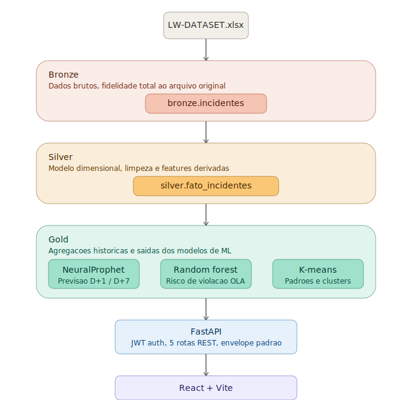

# Sentinel

Analytics preditivo de incidentes de TI, desenvolvido para o desafio **AIOps** proposto pela Locaweb em parceria com a FIAP (Challenge 2026, curso de Data Science).

<p align="center">
  
</p>

<p align="center">
  
  
  
  
  
</p>

---

## O problema

A Locaweb opera uma infraestrutura de TI 24x7 onde a disponibilidade dos serviços é um fator crítico de negócio. Incidentes operacionais são registrados continuamente, classificados por prioridade, categoria, equipe responsável e tempo de resolução — e cada um desses incidentes impacta diretamente os acordos de nível operacional (OLA).

O desafio proposto pela Locaweb foi transformar esse histórico operacional em inteligência preditiva: antecipar picos de incidentes antes que aconteçam, identificar onde o risco de violação de OLA está concentrado, e gerar recomendações práticas para a operação.

## A solução

O Sentinel é um MVP completo, de ponta a ponta: pipeline de dados, três modelos de machine learning, API REST autenticada e um painel web para consumo executivo. Não é um notebook de análise — é uma aplicação funcional, containerizada, pronta para ser apresentada e operada.

| Frente analítica | Técnica | O que responde |
|---|---|---|
| Histórico | Agregações EDA | Como o volume de incidentes se comporta por hora, dia e equipe |
| Previsão | NeuralProphet | Quantos incidentes esperar amanhã (D+1) e na próxima semana (D+7) |
| Risco de OLA | Random Forest | Qual a probabilidade de um incidente violar o acordo de nível operacional |
| Padrões | K-Means | Quais combinações de equipe, horário e prioridade formam clusters de risco |
| Recomendações | Regras de negócio | Onde agir: reforço de equipe, janelas críticas, categorias recorrentes |

## Arquitetura

O pipeline de dados segue arquitetura medalhão (Bronze → Silver → Gold), isolando a fidelidade ao dado bruto da camada de consumo analítico:

<p align="center">
  
</p>

- **Bronze** preserva o arquivo de origem sem transformação, garantindo rastreabilidade total.
- **Silver** aplica o modelo dimensional, limpeza e engenharia de features (sazonalidade, flags de OLA, campos derivados).
- **Gold** concentra as agregações históricas e as saídas dos três modelos de ML, prontas para consumo via API.
- **FastAPI** expõe os dados via 5 rotas REST autenticadas por JWT, com um envelope de resposta padronizado.
- **React + Vite** consome a API e renderiza os 6 painéis do dashboard.

## Stack técnica

**Pipeline e backend**
- Python 3.12, pandas, scikit-learn, NeuralProphet
- PostgreSQL 17 com schemas separados (`bronze`, `silver`, `gold`, `public`)
- FastAPI + SQLAlchemy 2.0, autenticação JWT (`python-jose` + `passlib`)

**Frontend**
- React 19, TypeScript, Vite
- Tailwind CSS, Recharts
- Axios com interceptors de autenticação

**Infraestrutura**
- Docker Compose orquestrando Postgres, API e frontend (build multi-stage com Nginx)

## Estrutura do repositório

```
fiap-sentinel/
├── backend/
│   ├── app/                  # FastAPI: rotas, schemas, services, modelos ORM
│   ├── pipeline/              # Ingestão, limpeza, agregação e treino dos modelos
│   ├── scripts/                # Utilitários (ex: criação de usuário)
│   ├── sql/                       # Scripts DDL (schemas Silver, Gold, autenticação)
│   ├── data/                     # Dataset de origem (não versionado)
│   ├── Dockerfile
│   ├── .env.example
│   └── requirements.txt
├── frontend/
│   ├── src/
│   │   ├── components/        # UI compartilhada (sidebar, cards, gráficos)
│   │   ├── lib/                    # Cliente HTTP, autenticação, hooks de dados
│   │   ├── pages/                 # Os 6 painéis do dashboard
│   │   ├── App.tsx
│   │   └── main.tsx
│   ├── Dockerfile
│   ├── nginx.conf
│   ├── .env.example
│   └── package.json
├── docs/
│   ├── architecture.svg
│   └── logo-placeholder.svg
├── docker-compose.yml
└── README.md
```

## Como executar

### Pré-requisitos
Docker e Docker Compose instalados.

### 1. Subir a infraestrutura

```bash
git clone https://github.com/<seu-usuario>/fiap-sentinel.git
cd fiap-sentinel
docker compose up -d --build
```

Isso sobe três serviços: PostgreSQL (`:5432`), API FastAPI (`:8000`) e frontend (`:5173`).

### 2. Popular o banco de dados

O pipeline completo (ingestão → limpeza → agregação → treino dos modelos → recomendações) é orquestrado por um único comando, executado dentro do container do backend:

```bash
docker compose exec backend python -m pipeline.run_pipeline
```

### 3. Criar um usuário de acesso

```bash
docker compose exec backend python -m scripts.create_user "Seu Nome" "seu@email.com" "sua-senha"
```

### 4. Acessar

| Serviço | URL |
|---|---|
| Aplicação | http://localhost:5173 |
| Documentação interativa da API | http://localhost:8000/docs |

## Decisões técnicas relevantes

Algumas decisões de modelagem valem registro, já que refletem limitações reais do dataset, não falhas de implementação:

- **P1-Crítica tem apenas 1 registro** na base de 122 mil incidentes. O desafio exige análise obrigatória de P2 e P3, que é onde o volume e a relevância de OLA realmente se concentram — P1 foi tratada como exceção estatística, não como erro.
- **O Random Forest tem recall baixo para a classe "Violado"**, mesmo com balanceamento de classes. O desbalanceamento é extremo (188 violações para quase 20 mil casos não violados no conjunto de treino) — é uma limitação estrutural dos dados, documentada e aceita como tal no MVP.
- **Métricas de atingimento de meta acima de 100%** (ex: 150%) indicam superação da meta, não violação dela — o cálculo usa faixas de excelência onde menos violações geram percentual maior, inspirado em sistemas de bônus corporativos.

## Equipe

Projeto desenvolvido para o Challenge FIAP × Locaweb 2026 - Grupo Datateston | 2TSCOA.

---

<p align="center"><sub>Dataset anonimizado fornecido pela Locaweb para fins acadêmicos.</sub></p>